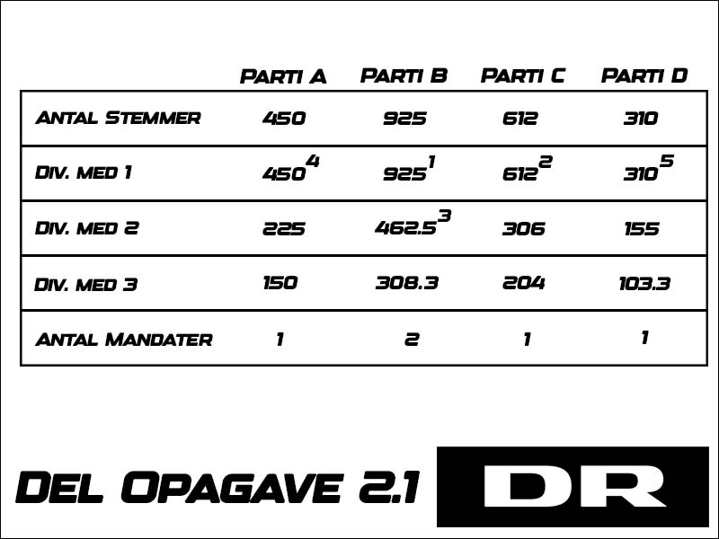

# DR-Mandatfordeling-Opgave

**Opgave 2.1**\
På billedet herunder har jeg lavet en tabel, der viser hvordan mandaterne fordeles i eksemplet i opgavebeskrivelsen.
Det lille opløftede tal, viser rækkefølgen af de højeste tal i tabellen.\
Da der skulle vælges 5 mandater, finder man så de fem største tal i tabellen, partiet tallet tilhører får denne mandat.\
Hvis der skulle findes en 6. mandat ville denne tilfalde parti B, der med 308.3 har det 6. største tal i tabellen.

\
**Opgave 2.2**\
I Dette git-hub repo burde du kunne finde løsningen på opgave 2.2. \
Du skal blot klone dette repo og køre projektet med "dotnet run" fra din terminal.\
Progammet kører en beregning af mandatfordelingen fra eksemplet og udskriver det i terminalen.\
Derefter vil den spørge om du vil prøve med din egen data.\
Svar på spørgsmålene og afslut med enter.\
Undlad at skrive bogstaver når den spørger om antal stemmer, partier eller mandater.

**Opgave 2.3**\
Denne simple applikation kan beregne en mandatfordeling til et komunnevalg. Med tidskompleksiteten O(n^2).\
Den kan tage imod en liste af partier og deres antal stemmer samt antallet af mandater der skal fordeles, og så fordele mandaterne.\
Den bruger d'Hondts metode, som er en metode man bruger i mange demokratier i hele verden.\
Det mest spæmndende er hvilke begrænsninger og antagleser applikationen har:
* Den går ud fra at partierne ikke er en del af nogen form for liste eller valg-forbund.
* Hvis to partier har lige meget ret til en mandat, og denne mandat er den sidste der bliver fordelt skal der trækkes lod, det har denne applikation ikke implementeret.
* Den virker kun i en konsol med C# lister, det ville være godt at give den API egnskaber og muligvis bruge en format som JSON til at sende valgdata.

